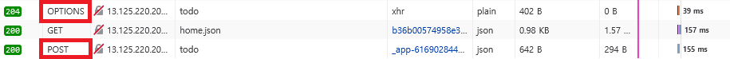
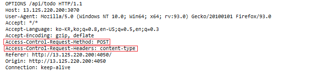

# 3장 HTTP 메시지

# 목차
- 3.1 HTTP 메시지란?
- 3.2 HTTP 메시지 흐름
- 3.3 메시지의 각 부분
- 3.4 메시지 문법
- 3.5 HTTP/0.9와 HTTP/2 메시지
- 3.6 HTTP 메시지 작성시 주의 사항

# 3.1 HTTP 메시지란?

HTTP 메시지는 클라이언트와 서버 간에 일을 처리(혹은 트랜잭션을 구현)하기 위해서 데이터의 블록입니다. 여기서 말하는 데이터 블록은 아래와 같습니다. 

 


또는 클라이언트와 서버 간에 데이터가 교환되는 방식이라고도 합니다.

# 3.2 HTTP 메시지 흐름

HTTP 메시지는 클라이언트, 서버, 프락시 사이를 흐릅니다. 

이 때 메시지 흐름의 방향을 나타내는 용어로 인바운드, 아웃바운드, 업스트림, 다운스트림이라는 용어를 사용합니다. 

## **3.2.1 트랜잭션 방향 표현**

먼저 인바운드와 아웃바운드를 HTTP에서는 트랜잭션 방향을 표현하기 위해 사용합니다.

[RFC 2616](https://www.rfc-editor.org/rfc/rfc2616#section-1.3)에서 설명하는 인바운드와 아웃바운드에 대한 의미는 다음과 같습니다.

- 인바운드: 원 서버(origin server)로 이동하는 것
- 아웃바운드: 사용자 에이전트로 이동하는 것


그래서 위 그림에서 볼 수 있듯이 메시지가 서버로 이동할 때는 인바운드로 이동하는 것이고, 서버에서 처리가 끝난 뒤에 클라이언트 복귀할 때는 아웃바운드로 이동하는 것입니다. 

## **3.2.2 메시지 흐름 표현**

HTTP 메시지의 흐름은 업스트림과 다운스트림이라는 용어로 표현되며, 용어 그 자체로 이해하시면 됩니다. 

- 업스트림: 위로 흐름
- 다운 스트림: 아래로 흐름

그리고 HTTP 메시지는 클라이언트 방향 혹은 서버 방향으로 이동하는 것과 상관 없이 다운스트림으로 흐릅니다.

업스트림과 다운 스트림은 발송자와 수신자를 기준으로 하며, 발송자는 수신자의 업스트림이 됩니다. 


# 3.3 메시지의 각 부분

메시지는 시작줄(Start line), 헤더(HTTP Headers), 본문(Body)으로 이뤄져있습니다. 


시작줄과 헤더는 ASCII 문자열이고, CRLF라는 줄바꿈(new line) 문자열로 끝나는데 위 이미지에서는 빈 줄(Empty line)이 여기에 해당됩니다.

시작줄이나 헤더와는 달리, 본문은 텍스트나 이진 데이터(ex. 음악, 동영상, 이미지 등등)를 포함할 수도 있고 그냥 비어있을 수도 있습니다.

<details>
<summary>📌참고 - CR / LF / CRLF</summary>

- CR(Carrige Return): \r 로 표시하며, 커서가 다음 라인으로 이동하지 않고 현재 라인에서 가장 앞으로 이동하는 것

- LF(Line Feed): \n 으로 표시하며, 커서의 위치는 그대로 있고 다음 줄로 이동하는 것

- CRLF: 새로운 줄로 바꾸는 것
</details>

# 3.4 메시지 문법

모든 HTTP 메시지는 요청 메시지나 응답 메시지로 분류됩니다. 
- 요청 메시지: 클라이언트가 서버로 전달해서 서버의 액션이 일어나게끔 하는 메시지
- 응답 메시지: 요청에 대한 서버의 답변

아래 이미지는 요청 메시지와 응답 메시지의 구조를 나타내고 있습니다. 각 메시지는 동일하게 시작줄, 헤더, 본문를 가지고 있습니다. 

그리고 헤더 목록의 끝에 빈 줄 즉, CRLF로 헤더 목록의 끝과 본문의 시작을 표시합니다.


이제 각각의 메시지 문법을 차례로 살펴 보겠습니다.

📝 아래 메소드나 상태 코드를 설명하기 위해 파이어폭스 개발자 도구의 네트워크 탭을 사용했습니다.  

## 3.4.1 시작줄

### 요청줄

서버에서 어떤 동작이 일어나야 하는지 설명해주는 역할을 합니다.


시작줄은 **메서드, URL, HTTP 버전**으로 구성되어 있습니다. 

그럼 각 구성 요소에 대해서 자세히 알아봅시다 :)

### 🚀메서드   

- 서버에게 무엇을 해야하는지 말해주는 역할을 합니다. 

- 모든 서버가 모든 메서드를 구현하지는 않습니다. 

- 메서드는 대부분 제한적으로 사용될 것인데, 이 제한은 일반적으로 서버 설정에 의해 정해지며 사이트마다 또 서버마다 다를 수 있습니다.

- 위 제한과 관련하여 예를 들면, DELETE나 PUT을 지원하는 서버는 아무나 리소스를 제거하거나 수정하지 못하도록 제한할 것입니다.  

**메서드 종류**

**GET**

- 서버에게 리소스를 요청하는 메서드이며, 데이터를 가져올 때만 사용. 

- 쿼리 문자열은 GET 요청의 URL로 전송

ex) http://localhost:3000/courses?order=popular&view=grid

- GET 요청시 브라우저 히스토리에 남음.

- GET 요청시 북마크 가능

- 중요한 데이터를 처리할 때 GET 요청으로 처리하면 안됨.

- 데이터를 전송할 때 GET 메서드는 데이터를 URL에 추가

- 최대 URL 길이는 2048자까지라서 데이터 길이에 제한이 있음.

- ASCII 데이터 타입만 전송 가능

**HEAD**

- GET 메서드의 요청과 동일한 응답을 요구하지만, 서버는 응답으로 헤더만 돌려주고 본문(reponse body)은 반환되지 않음. 

- 만약 본문이 존재하더라도 무시해야 함. 

- 클라이언트가 리소스를 실제로 가져올 필요 없이 헤더만을 조사할 수 있게 해줌. 

- 이 때 HEAD 요청을 통해 얻는 헤더는 GET 요청을 통해 얻는 헤더와 정확히 일치해야 함.

- GET요청을 실제로 수행하기 전, HEAD를 통해 알 수 있는 것
    - 헤더를 통해서 리소스 정보 얻기
    - 헤더를 통해서 리소스가 변경되었는지 검사하기
    - 응답의 상태 코드를 통해 개체가 존재하는지 확인

**POST**

- 서버로 데이터를 전송하는 메서드

- POST 요청은 보통 HTML 폼을 통해 서버에 전송

- POST 요청은 반복적으로 호출하면 동일한 리소스를 여러 번 생성하는 부작용이 발생

- POST 요청시 브라우저 히스토리에 남아있지 않음.

- POST 요청시 북마크를 할 수 없음.

- 데이터 전송 시 데이터 길이에 제한이 없음.

- 데이터 타입 제한 없음.

**PUT**

- 데이터를 서버로 전송해서 새로운 리소스를 생성하거나 수정(기존 데이터를 전송받은 데이터로 교체)하는데 사용

- POST와 달리 PUT은 데이터를 한 번 보내든 여러 번 보내든 같은 결과를 보여주고, 여러 번 보냈다고 하여 데이터 생성이 발생하지 않음.  
    - 이를 [멱등성](https://developer.mozilla.org/ko/docs/Glossary/Idempotent)이라 함.
    - PUT은 멱등성 특징을 갖는 메서드

**TRACE**

- 클라이언트에게 자신의 요청이 서버에 도달했을 때 어떻게 보이게 되는지 알려주며 이 과정에서 루프백 검사를 함.

    <details>
    <summary>📌참고 - '루프백'이란?</summary>

    디지털 데이트 스트림이 의도적인 수정없이 원래의 지점으로 되돌아가는 것
    [관련 설명 링크](https://www.techopedia.com/definition/25794/loopback-test)
    </details>

- TRACE 사용 예시

    - 요청이 의도한대로 요청/응답 연쇄(chain)를 통과하는지 확인할 수 있습니다.
    - 프락시나 다른 애플리케이션들이 요청에 어떤 영향을 미치는지 알 수 있습니다.


- 요청이 유효하다면, 응답은 전체 요청 메시지를 Content-type: "message/http" 헤더와 함께 본문에 포함시켜야 함. ([RFC2616 참고](https://www.rfc-editor.org/rfc/rfc2616#section-9.8))

**OPTIONS**

- 지정된 URL 또는 서버에 대해 허용된 통신 옵션을 요청

- 예를 들면 클라이언트는 특정 리소스에 대해 어떤 메서드가 지원되는지 물어볼 수 있음. 
<details>
<summary>📌참고 - OPTIONS와 CORS</summary>

이번에 공부하면서 제가 개발한 웹 사이트의 http 요청을 확인하는데 POST나 DELETE, PUT 요청을 하기 전에 OPTIONS 메서드가 발생하는 것을 볼 수 있었습니다. 

아래는 POST 요청 전, OPTIONS 요청이 발생한 모습입니다. 



실제 OPTIONS의 요청 메시지는 아래와 같습니다.


- Access-Control-Request-Method: preflight 요청의 일부분으로 서버에게 실제 요청이 전달 될 때 POST 요청 메소드로 전달될 것 임을 명시
- Access-Control-Request-Headers서버에게 실제 요청이 전달될 때 Content-Type과 함께 전달될 것 임을 명사

이렇게 OPTIONS 요청이 사전에 발생하는 이유는 무엇일까요?

CORS 에서, OPTIONS 메소드를 통해 프리플라이트 요청 (preflight, 사전 전달), 즉 사전 요청을 보내 서버가 해당 parameters를 포함한 요청을 보내도 되는지에 대한 응답을 줄 수 있게 하기 위해서 입니다.

이와 관련된 자세한 내용은 [MDN 문서](https://developer.mozilla.org/ko/docs/Web/HTTP/Methods/OPTIONS)와 [이 글](https://nukeguys.github.io/dev/options-request/)을 참고해주세요.
</details>
<br />

**DELETE**

- 서버에게 요청 URL로 지정한 리소스를 삭제할 것을 요청 

- 그러나 서버에서 반환된 상태 코드가 삭제 작업이 성공적으로 완료되었음을 나타내더라도, 클라이언트는 이 작업이 수행된 것을 보장할 수 없음.

- [HTTP 명세](https://datatracker.ietf.org/doc/html/rfc2616#section-9.7)에서 DELETE는 서버에서 사람의 개입 혹은 다른 방법으로 재정의될 수도 있다고 나와있기 때문. 

**PATCH**

- 책에서는 다루지 않지만, 생성없이 수정만 담당하며 리소스의 일부분을 수정할 때 사용하는 메서드. 

- PUT은 리소스의 모든 속성을 수정하기위해 사용한다는 점에서 일부분만 수정하는 PATCH와 차이가 있음. 

<!-- details 사용하기 -->
<details>
<summary>📌참고 - PATCH가 있음에도 PUT을 사용하는 이유</summary>

실제로 PUT을 사용할 때 실수하면 치명적인 이슈가 발생할 수 있기 때문인데 관련된 내용으로는 [이 글](https://www.inflearn.com/questions/93071)을 참고해주세요 :)
</details>
<br />

**확장 메서드**

- HTTP/1.1 명세에 정의되지 않은 메서드

- HTTP는 필요에 따라 확장해도 문제가 없도록 설계되어 있으며, 새로 기능을 추가해도 과거에 구현된 소프트웨어들의 오동작을 유발하지 않음.

아래는 대표적인 확장 메서드입니다. 

|메서드 |설명                            |
|------|--------------------------------|
|LOCK  |사용자가 리소스를 잠글 수 있게 해줌|
|MIKCOL|사용자가 문서를 생성할 수 있게 해줌|
|COPY  |서버에 있는 리소스를 복사         |
|MOVE  |서버에 있는 리소스를 옮김         |


**안전한 메서드**

- HTTP 메서드가 서버의 상태를 바꾸지 않으면, 해당 메서드가 안전하다고 말함. 

- 즉, 읽기 작업만 수행하는 메서드는 안전합니다. 그리고 HTTP 요청의 결과로 인해 서버에서 일어나는 일은 아무것도 없음.

- 메서드 중에서는 GET, HEAD, OPTIONS 그리고 TRACE가 해당 됨.

- 브라우저 입장에서는 안전한 메서드라면 서버에 해를 끼치지 않을 것임을 알 수 있기 때문에 자유롭게 호출이 가능

- 안전한 메서드를 활용한 예
    - 브라우저 prefetching 동작 수행
    - 웹 크롤러가 있습니다. 
    <details>
    <summary>📌참고 - 'Prefetching'이란?</summary>
    
    브라우저가 유휴 시간을 이용하여 사용자가 방문하게 될 문서를 미리 다운로드 혹은 프리패치하여 cache에 저장해서 로딩타임을 줄 일 수 있는 기법.
    [관련 설명 링크](https://blog.daum.net/wetsand/64)
    </details>

- 그렇지만 안전한 메서드가 서버에 작용을 유발하지 않는다는 보장이 없음. 그래서 안전하지 않는 메서드가 사용될 때 사용자들에게 그 사실을 알려주는 HTTP 애플리케이션을 만들 수 있도록 함. 
(ex. 신용 카드 결제가 된다는 것을 알려주는 경고 메세지 띄우기) 

- 또한 메서드의 안전함을 준수하는 것은 온전히 서버 어플리케이션의 책임으로 Apache나 Nginx와 같은 웹 서버는 스스로 안전함을 강제하지 못함. 특히 GET 요청을 받았을 때 자신의 상태가 바뀌지 않도록 해야 함. 

<details>
<summary>📌참고 - 각 메서드의 캐시, 안전함, 멱등성, HTML 양식에서 사용 가능 여부</summary>

|메서드  |캐시|안전함|멱등성|HTML 양식에서 사용 가능|
|:-----:|:--:|:---:|:----:|:-------------------:|
|GET    |O   |O    |O     |O                    |   
|HEAD   |O   |O    |O     |X                    |   
|POST   |새로운 정보가 포함됐을 때만 가능|X    |X     |O                    |   
|PUT    |X   |X    |O     |X                    |   
|DELETE |X   |x    |O     |X                    |   
|OPTIONS|X   |O    |O     |X                    |   
|TRACE  |X   |O    |O     |X                    |   
|PATCH  |X   |X    |x     |X                    |   
</details>

<details>
<summary>📌참고 - 새로운 메서드 SEARCH</summary>
    
SEARCH는 request body를 포함해서 클라이언트의 요청을 안전하게 처리하기 위해 제안된 HTTP의 새로운 메서드입니다. 
자세한 내용은 [이 글](https://yozm.wishket.com/magazine/detail/694/)을 참고해주세요 :)
</details>

 
    
### 🚀요청 URL
    
요청 대상이 되는 리소스를 지칭하는 완전한 URL 혹은 URL의 경로 구성요소
    
### 🚀HTTP버전
    
- HTTP 애플리케이션들이 자신이 따르는 HTTP의 버전을 상대방에게 말해주기 위한 수단으로, 애플리케이션이 지원하는 가장 높은 HTTP 버전을 가리킵니다. 

- 형식은 아래와 같으며 분수가 아니라 .을 기준으로 분리된 숫자(정수)로 봐야합니다. 예를 들어 1.22가 1.3 보다 버전이 높습니다.

```
HTTP/<메이저>.<마이너>
```

- 버전 번호가 필요한 이유
    - HTTP로 대화하는 애플리케이션들에게 대화 상대의 능력과 메시지의 형식에 대한 단서를 제공해주기 위한 것 

    - 예를 들어 HTTP 1.1과 새로운 기능이 추가된 HTTP 1.2가 서로 대화한다고 할 때, 1.1은 1.2가 가진 기능을 사용할 수 없다는 것을 1.2는 알아야 함.  
        
    

### 응답줄

수행 결과에 대한 상태 정보와 결과 데이터를 클라이언트에게 돌려줍니다. 


시작줄은 **HTTP 버전, 상태 코드, 사유 구절**로 구성되어 있습니다. 
    
### 🚀버전 번호
    
요청줄에서 버전 번호를 작성하는 방법과 동일
    
### 🚀상태 코드
    
- 지정한 HTTP 요청이 성공적으로 완료되었는지를 나타냄. 
    
- 숫자로 된 코드는 프로그램이 에러를 처리하기 쉬움. 
    
- 프로토콜이 진화하면서 더 많은 상태코드가 HTTP 명세에 공식적으로 정의될 것. 그래서 내가 모르는 상태 코드를 받게 되면, 누군가 프로토콜의 확장으로 정의했을 가능성이 있음. 
    <!-- details -->
    <details>
    <summary>📌참고 - 프로토콜의 확장으로 정의된 상태코드의 예</summary>
    
    Host가[https://developer.mozilla.org/](https://developer.mozilla.org/) 일 때, 414 상태 코드가 응답 메세지로 출력되는지 궁금해서 3000자 넘는 글자를 URL로 전달해서 테스트해보았는데 494라는 상태 코드를 만나게 되었습니다. Nginx 서버에서 만들어진 상태코드로 요청 헤더가 너무 컸을 때 발생하는 것 같습니다. 아마 요청 메세지의 path 헤더가 3000자가 넘어서 발생한 것 같아요. 우연히 발견하게 되어 확장된 프로토콜의 상태 코드 예시로 공유해봅니다 :)
    
    414 상태 코드에 대한 설명은 아래 400~499 상태 코드 설명에서 참고해주세요

    
    </details>

📝 책에 있는 모든 상태 코드를 다루기 보다는 자주 사용되는 상태 코드 위주로 다뤘습니다.

📝 아래에 소개되지 않은 다양한 상태코드와 브라우저별 지원되는 상태코드 [이 글](https://developer.mozilla.org/ko/docs/Web/HTTP/Status)을 통해 확인해주시길 바랍니다 :)

**100~199: 정보성 상태 코드**   

`100 Continue`

- 클라이언트가 서버로 보낸 요청에 문제가 없으니 다음 요청을 이어서 보내도 된다는 것을 의미
- 만약 클라이언트의 작업(본문 수신)이 완료되었다면 이 응답은 무시해도 됨.
- 클라이언트가 서버로 하여금 검토하게 하려면 첫 번째 요청에서 Expect: 100-continue 헤더를 보내야 함. 이후 클라이언트는 본문을 보내기 전에 서버가 100 Continue 상태 코드로 응답하길 기다려야 함.
- 하지만, 막연히 기다리지 말고 약간의 타임 아웃 후에는 그냥 엔터티를 보내야 함.
- 만약 HTTP 1.1 이전의 버전을 사용하는 웹 서버나 애플리케이션을 사용한다면 문제가 될 수 있다.

**200~299: 성공 상태 코드**
   
`200 OK`   

- 요청 성공
- 새롭게 업데이트한 페이지를 보여줘야할 경우에 사용
- 아래는 네이버에 접속했을 때 발생하는 200 상태코드 입니다.
    
    
    
   
`201 Created`   

- 요청이 성공적으로 처리되었으며, 리소스가 생성되었음을 나타냄.
   
`202 Accepted`   

- 요청이 성공적으로 접수되었으나, 아직 해당 요청에 대해 처리중이거나 처리 시작 전임을 의미함.
- 요청이 처리 중 실패할 수도 있기 때문에 요청은 실행될 수도 실행되지 않을 수도 있음.
   
`204 No Content`   

- 헤더와 상태줄(시작줄)을 포함하지만 엔터티 본문은 포함하지 않음.
- 204를 반환하는 경우는 PUT 요청에 대한 응답으로, 사용자에게 보여지는 페이지를 바꾸지 않고 리소스를 업데이트할 때 사용됨.
- OPTIONS 메서드가 실행되었을 때 204 상태코드가 발생하는 것을 볼 수 있었습니다.
    
    
    

**300~399: 리다이렉션 상태 코드**

리다이렉션을 통해 리소스가 옮겨졌다면, 클라이언트에게 리다이렉션 상태 코드와 (선택적으로)Location 헤더를 보내 바뀐 위치를 알려줄 수 있습니다.

가장 적절한 리다이렉트 상태 코드를 선택하기 위해 클라이언트의 HTTP 버전을 검사할 필요가 있습니다. 
   
`300 Multiple Choices`   

- 클라이언트가 동시에 여러 리소스를 가리키는 URL을 요청한 경우, 그 리소스의 목록과 함께 반환하고, 사용자는 목록에서 원하는 하나 선택 가능
- 하나의 HTML 문서에 다국어를 제공하는 경우 사용 가능
   
`301 Moved Permaently`   

- 요청한 리소스가 Location 헤더에 주어진 URL로 완전히 옮겨졌다는 것을 나타냄
- 리다이렉트를 수행할 때 메소드와 응답 본문이 바뀌어서는 안됨.
- 그러므로 301코드는 GET과 HEAD 메소드의 응답으로만 사용
   
`302 Found`   

- 301 상태 코드과 같으며, 클라이언트가 요청한 리소스가 Location 헤더에 주어진 URL에 일시적으로 이동되었음을 가리킴.
- 아래는 제가 만든 웹 사이트에서 발생한 응답 메시지인데, http://13.125.220.200:3000/reser/step1 에서 http://13.125.220.200:3000/reser/step2로 리다이렉트 할 때 302 상태 코드를 받은 응답 메시지 입니다.
    
    
    
    근데 위 이미지에서 표현되지는 않았지만 POST 요청 후 GET 요청을 하는 리다이렉션 과정이 이뤄집니다. HTTP 명세에서는 리다이렉션 과정에서 메서드가 변경되어서는 안된다고 명시되어 있다고 해서 302 상태 코드 대신 307 코드를 사용하는 게 더 적절합니다.  
    
   
`303 See Other`   

- 클라이언트에게 리소스를 다른 URL에서 가져와야 한다고 말해주고자 할 때 쓰임.
   
`304 Not Modified`   

- 클라이언트는 헤더를 이용해 조건부 요청을 만들 수 있음.
- 만약 클라이언트가 GET 요청을 통해 If-Modified-Since 헤더를 전달했고, 요청한 리소스가 최근에 수정된 일이 없다면 이 코드는 리소스가 수정되지 않았다는 것을 의미
- 304 상태 코드는 리소스가 캐시된 상태
- 아래는 실제로 bootstrap.min.js 파일이 2021년 7월 27일 화요일 16:11:01 GMT이후 수정이 된 적이 없어서 304 상태 코드 메시지를 받은 모습입니다.

    

   
`307 Temporary Redirect`   

- 301 상태코드와 비슷함.
- 그러나 클라이언트는 Location 헤더에 주어진 URL을 임시로 리소스를 가리키기 위한 목적으로 사용해야 함.
- 사용자 에이전트가 반드시 사용된 HTTP 메소드를 변경하지 말아야 하는 점만 다름. 만약 첫 요청에 POST가 사용되었다면, 두번째 요청도 반드시 POST를 사용해야 함.

📌참고 - 305 Use Proxy 상태코드는 deprecated 되었습니다.

**404~499: 클라이언트 에러 상태 코드**
   
`400 Bad Request`   

- 클라이언트가 잘못된 요청을 보냈다고 말해줌.
- 잘못된 요청 구문, 유효하지 않은 요청 [메시지 프레이밍](https://theamiableapi.com/2012/04/01/message-framing-in-rest/), 또는 변조된 요청 라우팅과 같은 클라이언트 오류를 감지해 요청을 처리할 수 없거나 하지 않는다는 것을 의미.
   
`401 Unauthorized`   

- 해당 리소스에 유효한 인증 자격 증명이 없기 때문에 요청이 적용되지 않았음을 나타냄.
- 아래 이미지는 로그인 시도 후 실패했을 때 401 상태 코드가 발생한 모습입니다.
    
    
   
`403 Forbidden`   

- 요청이 서버에 의해 거부됨.
   
`404 Not Found`   

- 서버가 요청한 URL을 찾을 수 없음을 알려주기 위해 사용함.
- 아래와 같이 종종 클라이언트 애플리케이션이 사용자에게 보여주기 위한 엔터티가 포함되기도 함. 아래는 [naver.com/ff](http://naver.com/ff)로 접속했을 때의 예시다.
    
    
   
`405 Method Not Allowed`   

- 요청한 URL에 대해, 지원하지 않는 메서드로 요청받았을 때 사용함.
- 요청한 리소스에 대해 어떤 메서드가 사용 가능한지 클라이언트에게 알려주기 위해, 요청에 Allow 헤거다 포함되어야 함.
- 유의 사항으로는 두 가지 필수 메소드인 GET과 HEAD는 사용 불가능 하여서는 안 되며, 이러한 오류 타입을 반환해서는 안됨.
- 아래는 [한국어 맞춤법 검사기의 결과 페이지](http://speller.cs.pusan.ac.kr/results)로 바로 접속하게 됐을 때 HTML 문서로 405 에러와 함께 GET 메서드는 지원을 하지 않는다는 내용을 볼 수 있음.
    
    
   
`409 Conflict`   

- 서버의 현재 상태와 요청이 충돌했음을 나타냄.
- 충돌은 PUT 요청에 대응하여 발생할 가능성이 가장 높음. 예를 들어 서버에 이미 있는 파일보다 오래된 파일을 업로드 할 때 발생할 수 있음.
   
`414 Request URI Too Long`   

- 서버가 처리할 수 있는 혹은 처리하고나 하는 한계를 넘은 길이의 요청 URL이 포함된 요청을 클라이언트가 보냈을 때 사용함.

    

**500~599: 서버 에러 상태 코드**
   
`500 Internal Server Error`   

- 서버가 요청을 처리할 수 없게 만드는 에러를 만났을 때 사용
   
`502 Bad Gateway`   

- [RFC7231](https://datatracker.ietf.org/doc/html/rfc7231#section-6.6.3)에서 설명하는 502 상태코드는 서버가 게이트웨이 또는 프록시 역할을 하는 동안 요청을 수행하려고 시도하는 동안 액세스한 인바운드 서버로부터 잘못된 응답을 받았음을 나타내는 것.
   
`503 Service Unavaliable`   

- 현재는 서버가 요청을 처리해 줄 수 없지만 나중에는 가능하을 의미하고자 할 때 사용함.
- 일반적인 원인은 유지보수를 위해 작동이 중단되거나, 과부하가 걸렸을 때 발생함.
- 보통 티켓팅이나 수강신청 등의 이벤트로 트래픽이 초과 되었을 때 만날 수 있음.
    
     
   
`504 Gateway Timeout`   

- [RFC 7231](https://datatracker.ietf.org/doc/html/rfc7231#section-6.6.5)에서 설명하는 504 상태코드는 서버가 게이트웨이 또는 프록시 역할을 하는 동안 요청을 완료하기 위해 액세스해야 하는 업스트림 서버로부터 제때 응답을 받지 못했음을 나타냄.

    
### 🚀사유 구절
    
상태 코드에 대해 사람이 이해하기 쉽도록 글로 된 설명을 제공합니다. 
예를 들면, HTTP/1.1 200 OK 에서 OK가 사유 구절입니다.

상태 코드와 일대일로 대응되지만, HTTP/1.1 200 NOT OK 라고 되어있어도 상태 코드 200은 성공을 처리하기 때문에 사유 구절과 상관없이 상태 코드 값을 기준으로 작업을 수행해야 합니다. 

사유 구절의 예시는 위의 상태코드 옆 글자(ex. Not Found, Not Modified 등등)를 참고해주세요 :)
    
## 3.4.2 헤더
    
클라이언트와 서버가 요청 또는 응답으로 부가적인 정보를 전송할 수 있도록 해줍니다. 

헤더는 대소문자를 구분하지 않는 이름과 콜론' : ' 다음에 오는 값으로 이루어져 있고, 값 앞에 붙은 빈 문자열은 무시됩니다. 

HTTP 헤더의 집합은 항상 빈줄(CRLF)로 끝나야 합니다. 

헤더는 일반 헤더, 요청 헤더, 응답 헤더, 엔터티 헤더, 확장 헤더 등으로 분류됩니다. 

📝 헤더도 마찬가지로 자주 보이는 헤더 위주로 정리했습니다.

📝 아래 소개되지 않은 다양한 헤더들은 [이 글](https://developer.mozilla.org/ko/docs/Web/HTTP/Headers)을 통해 확인해주세요 :)

### 일반 헤더
    
- 요청과 응답 모두에 적용되며, 메시지에 대한 아주 기본적인 정보를 제공

- Body에서 최종적으로 전송되는 데이터와는 관련이 없는 헤더

    |헤더|설명|MDN 문서 링크|
    |:--:|:------:|:------:|
    |Date|메시지가 만들어진 날짜와 시간을 포함|[자세한 설명](https://developer.mozilla.org/ko/docs/Web/HTTP/Headers/Date)|
    |Connection|현재의 전송이 완료된 후 네트워크 접속을 유지할지 말지를 제어|[자세한 설명](https://developer.mozilla.org/ko/docs/Web/HTTP/Headers/Connection)|


#### 일반 캐시 헤더
    
- HTTP/1.0은 HTTP 애플리케이션에게 매번 서버로부터 객체를 가져오는 대신 로컬 복사본으로 캐시할 수 있도록 해주는 최초의 헤더를 도입함.
    
    |헤더|설명|MDN 문서 링크|
    |:--:|:------:|:------:|
    |Cache-Control|메시지와 함께 캐시 지지자를 전달하기 위해 사용|[자세한 설명](https://developer.mozilla.org/ko/docs/Web/HTTP/Headers/Cache-Control)|

        
### 요청 헤더
    
- 요청 메시지에서만 의미를 갖는 헤더

- fetch될 리소스나 클라이언트 자체에 대한 자세한 정보를 포함하는 헤더

- 요청에 나타나는 모든 헤더가 요청 헤더인 것은 아님 (ex. 엔터티 헤더인 content-length)

    |헤더|설명|MDN 문서 링크|
    |:--:|:------:|:------:|
    |Host|서버의 호스트명과 포트|[자세한 설명](https://developer.mozilla.org/ko/docs/Web/HTTP/Headers/Host)|
    |User-Agent|요청을 보낸 애플리케이션의 이름|[자세한 설명](https://developer.mozilla.org/en-US/docs/Web/HTTP/Headers/User-Agent)|
    |Origin|POST같은 요청을 보낼 때, 요청이 어느 주소에서 시작되었는지를 나타냄|[자세한 설명](https://developer.mozilla.org/ko/docs/Web/HTTP/Headers/Origin)|
    |Referer|현재 페이지로 연결되는 링크가 있던 이전 웹 페이지의 주소|[자세한 설명](https://developer.mozilla.org/ko/docs/Web/HTTP/Headers/Referer)|


#### Accept 관련 헤더
    
- 자신의 선호와 능력을 알려줄 수 있는 헤더

- 클라이언트가 무엇을 원하고, 무엇을 할 수 있는지, 무엇을 원하지 않는지 등을 통해 서버는 무엇을 보낼 것인가에 대해 더 똑똑한 결정을 내릴 수 있음.

    |헤더|설명|MDN 문서 링크|
    |:--:|:------:|:------:|
    |Accept|클라이언트가 이해 가능한 컨텐츠 타입이 무엇인지를 알려줌.|[자세한 설명](https://developer.mozilla.org/ko/docs/Web/HTTP/Headers/Accept)|
    
#### 조건부 요청 헤더
    
- 클라이언트는 서버에게 요청에 응답하기 전에 먼저 조건이 참인지 확인하게 하는 제약을 포함시킬 수 있음.

    |헤더|설명|MDN 문서 링크|
    |:--:|:------:|:------:|
    |If-Modified-Since|주어진 날짜 이후에 리소스가 변경되지 않았다면 요청을 제한함.|[자세한 설명](https://developer.mozilla.org/ko/docs/Web/HTTP/Headers/If-Modified-Since)|
    |If-None-Match|서버보고 ETag가 달라졌는 지 검사해서 ETag가 다를 경우에만 컨텐츠를 새로 내려주라는 뜻|[자세한 설명](https://developer.mozilla.org/en-US/docs/Web/HTTP/Headers/If-None-Match)|
    
#### 요청 보안 헤더
    
- HTTP는 자체적으로 요청을 위한 간단한 인증요구/응답 체계를 갖춤.

- 요청하는 클라이언트가 어느 정도 리소스에 접근하기 전에 자신을 인증하게 함으로써 트랜잭션을 약간 더 안전하게 만들기 위해 사용하는 헤더

    |헤더|설명|MDN 문서 링크|
    |:--:|:------:|:------:|
    |Authorization|클라이언트가 서버에게 제공하는 인증 그 자체에 대한 정보를 담음.|[자세한 설명](https://developer.mozilla.org/ko/docs/Web/HTTP/Headers/Authorization)|
    |Cookie|클라이언트가 서버에게 토큰(쿠키)을 전달할 떄 사용|[자세한 설명](https://developer.mozilla.org/ko/docs/Web/HTTP/Headers/Cookie)|
    

#### 프락시 요청 헤더

- 프락시의 기능을 돕기 위한 헤더

### 응답 헤더

- 위치 또는 서버 자체에 대한 정보(이름, 버전 등)와 같이 응답에 대한 부가 정보를 갖고, 클라이언트에게 제공

- 응답에 나타나는 모든 헤더가 응답 헤더인 것은 아님 (ex. 엔터티 헤더인 content-length)

    |헤더|설명|MDN 문서 링크|
    |:--:|:------:|:------:|
    |Age|캐시 응답 때 나타나는데, max-age 시간 내에서 얼마나 흘렀는지 초 단위로 알려줌.|[자세한 설명](https://developer.mozilla.org/ko/docs/Web/HTTP/Headers/Allow)|
    |Content-Disposition|응답 본문을 브라우저가 어떻게 표시해야 할지 알려주는 헤더 주로 다운로드 관련해서 사용됨.|[자세한 설명](https://developer.mozilla.org/ko/docs/Web/HTTP/Headers/Content-Disposition)|
    |Content-Security-Policy|다른 외부 파일들을 불러오는 경우, 차단할 소스와 불러올 소스를 여기에 명시|[자세한 설명](https://developer.mozilla.org/en-US/docs/Web/HTTP/Headers/Cross-Origin-Resource-Policy)|


📌참고 - CORS와 관련된 헤더들은 [여기](https://developer.mozilla.org/ko/docs/Web/HTTP/Headers#cors)를 참고해주세요.

##### 협상 헤더

- 서버가 협상 가능한 리소스에 대한 정보를 운반하는 헤더

##### 응답 보안 헤더

- 기본적으로 HTTP 인증요구/응답 체계에서 응답 측에 해당하는 요청 보안 헤더

    |헤더|설명|MDN 문서 링크|
    |:--:|:------:|:------:|
    |Set-Cookie|서버가 클라이언트를 인증할 수 있도록 클라이언트 측에 토큰을 설정하기 위해 사용|[자세한 설명](https://developer.mozilla.org/ko/docs/Web/HTTP/Headers/Set-Cookie)|
    |WWW-Authenticate|서버에서 클라이언트로 보낸 인증요구의 목록|[자세한 설명](https://developer.mozilla.org/en-US/docs/Web/HTTP/Headers/WWW-Authenticate)|

### 엔터티 헤더

- 엔터티 바디에 대한 자세한 정보를 포함하는 헤더

- 요청과 응답 양쪽 모두에 엔터티(본문)을 포함하기 떄문에 양쪽 모두 엔터티 헤더가 나타날 수 있음.

    |헤더|설명|MDN 문서 링크|
    |:--:|:------:|:------:|
    |Allow|엔터티에 대해 수행될 수 있는 요청 메서드들을 나열|[자세한 설명](https://developer.mozilla.org/ko/docs/Web/HTTP/Headers/Allow)|
    |Location|페이지를 리다이렉트할 URL|[자세한 설명](https://developer.mozilla.org/en-US/docs/Web/HTTP/Headers/Location)|

#### 콘텐츠 헤더

- 엔터티의 콘텐츠에 대한 구체적인 정보 제공

    |헤더|설명|MDN 문서 링크|
    |:--:|:------:|:------:|
    |Content-Length|본문 길이나 크기를 바이트 단위로 표시|[자세한 설명]()|
    |Content-Type|컨텐츠 타입과 문자열 인코등 명시|[자세한 설명](https://developer.mozilla.org/ko/docs/Web/HTTP/Headers/Content-Type)|
    |Content-Language|사용자의 언어|[자세한 설명](https://developer.mozilla.org/ko/docs/Web/HTTP/Headers/Content-Language)|
    |Content-Encoding|컨텐츠가 압축된 방식|[자세한 설명](https://developer.mozilla.org/ko/docs/Web/HTTP/Headers/Content-Encoding)|
    

#### 엔터티 캐싱 헤더

- 엔터티 캐싱에 대한 정보를 제공

- 리소스에 대해 캐시된 사본이 아직 유효한지에 대한 정보와 캐시된 리소스가 더 이상 유효하지 않게 되는 시점 추정을 위한 단서

    |헤더|설명|MDN 문서 링크|
    |:--:|:------:|:------:|
    |ETag|HTTP 컨텐츠가 바뀌었는지를 검사할 수 있는 태그|[자세한 설명](https://developer.mozilla.org/ko/docs/Web/HTTP/Headers/ETag)|
    |Expires|응답 컨텐츠가 언제 만료되는지를 나타냄|[자세한 설명](https://developer.mozilla.org/ko/docs/Web/HTTP/Headers/Expires)|

### 헤더와 관련하여 읽어보면 좋은 글

[알아둬야 할 HTTP 공통 & 요청 헤더](https://www.zerocho.com/category/HTTP/post/5b3ba2d0b3dabd001b53b9db)   
[알아둬야 할 HTTP 응답 헤더](https://www.zerocho.com/category/HTTP/post/5b4c4e3efc5052001b4f519b)   
[알아둬야 할 HTTP 쿠키 & 캐시 헤더](https://www.zerocho.com/category/HTTP/post/5b594dd3c06fa2001b89feb9)   


### 3.4.3 본문(엔터티 본문)
    
- 선택적인 데이터 덩어리로, HTTP 메시지의 화물. 

- 그래서 이미지, 비디오, HTML 문서 등등 여러 종류의 디지털 데이터를 실어 나를 수 있음. 

- 하지만 모든 메시지가 본문을 갖는 것이 아니기 때문에 그냥 빈줄(CRLF)로 끝나기도 함. 빈줄로 끝난다는 의미는 위의 메시지 문법 예시 이미지에서 확인 가능

- 각 메서드 마다 본문이 존재할수도, 안 할수도 있습니다. 아래 표를 참고해주세요.

    |메서드  |요청의 경우|응답의 경우|
    |:------:|:--------:|:--------:|
    |GET     |X         |O         |
    |HEAD    |X         |O         |
    |POST    |O         |O         |
    |PUT     |O         |X         |
    |OPTIONS |X         |O         |
    |DELETE  |May       |May       |
    |PATCH   |O         |O         |
    |TRACE   |X         |O         |

    <!-- details로 표현하기 -->
    <details>
    <summary>📌참고 - DELETE에 May라고 표시되어 있는 이유</summary>

    MDN 문서에서는 DELETE를 May라고 표시가 되어있어서 [궁금해서 찾아보니](https://stackoverflow.com/questions/299628/is-an-entity-body-allowed-for-an-http-delete-request), 2014년 6월에 업데이트된 HTTP 1.1 명세 ([RFC7231](https://datatracker.ietf.org/doc/html/rfc7231#section-4.3.5))에 따르면 payload 경우에는 따로 정의된 바가 없기 때문에 DELETE 요청에 본문이 포함되는 것을 명시적으로 허용하는 것 같습니다. 다만 구현하는 서버측에 따라 request body 사용을 거절할 수 있습니다. 

    [payload란?](https://i.kakao.com/docs/key-concepts-parameters#request-payload-%EA%B5%AC%EC%84%B1.)

    HTTP 요청을 보낼 때 포함되는 데이터를 말합니다. payload는 JSON 형태를 가지고 있습니다. 

    또한 스프링 버전에 따라 delete 요청으로 보낸 request body를 받지 못할 수도 있다고 하니 [이 글](https://jasper-rabbit.github.io/posts/resttemplate-delete-with-payload/)을 참고 바랍니다.

    DELETE의 응답 메시지 경우, [이 글](https://stackoverflow.com/questions/6581285/is-a-response-body-allowed-for-a-http-delete-request)과 책을 참고 했을 때, 상태코드가 200(OK), 202(Accepted)인 경우에는 본문을 포함하고, 204(No Content)인 경우에는 포함하지 않기 때문에 May라고 표현한 것 같습니다.
    </details>

# 3.5 HTTP/0.9와 HTTP/2 메시지

## HTTP/0.9 메시지


- 요청은 메서드와 요청 URL만 가짐
- 응답은 엔터티만 가짐.
- 이러한 지나칠 정도의 단순함으로 다양한 상황에 대응할 수 없었음
- 또한 HTTP의 기능들과 애플리케이션도 대부분 구현 불가능했음.

## HTTP/2 메시지


- 메세지 외에 프레임과 스트림이라는 새로운 단위 추가
  - 스트림: 구성된 연결 내에서 전달되는 바이트의 양방향 흐름이며, 하나 이상의 메시지가 전달될 수 있음.
  - 메시지: 논리적 요청 또는 응답 메시지에 매핑되는 프레임의 전체 시퀀스.
  - 프레임: HTTP/2에서 통신의 최소 단위이며 각 최소 단위에는 하나의 프레임 헤더가 포함됨. 이 프레임 헤더는 최소한으로 프레임이 속하는 스트림을 식별.
- HTTP/1.x 메시지를 프레임으로 나누어 스트림에 끼워넣음.
- 헤더 필드를 압축을 도입하고 동일한 연결에서 다중 동시 교환을 허용함으로써 네트워크 리소스를 보다 효율적으로 사용하고 지연 시간을 줄임.
- 요청의 우선순위 지정을 허용함으로써 더 중요한 요청이 더 빨리 완료되도록 하여 성능을 더욱 개선
- 더 자세한 내용은 [HTTP/2 ](https://developers.google.com/web/fundamentals/performance/http2) 참고

# 3.6 HTTP 메시지 작성시 주의 사항

책에 작성된 HTTP 메서드 명세는 [1999년에 작성된 글의 기준](https://www.rfc-editor.org/rfc/rfc2616)으로 작성된 것 같습니다. [2014년에 작성된 HTTP 명세](https://datatracker.ietf.org/doc/html/rfc7231)에서 일부 추가된 내용이 있으니 확인바랍니다.

# 3.7 참고 자료

📝 이미 위에 추가된 링크는 재포함 하지 않았습니다.   
📝 참고로 대부분 [RFC2616](https://www.rfc-editor.org/rfc/rfc2616#page-56) 와 [rfc7231](https://datatracker.ietf.org/doc/html/rfc7231) 그리고 [MDN의 HTTP 문서](https://developer.mozilla.org/ko/docs/Web/HTTP)를 많이 참고했습니다. 
   
[HTTP 메시지(MDN 문서)](https://developer.mozilla.org/ko/docs/Web/HTTP/Messages)   
[HTTP 메시지 설명에 사용된 이미지](https://feel5ny.github.io/2019/08/15/HTTP_003_01/)
[안전한 메서드(MDN 문서)](https://developer.mozilla.org/ko/docs/Glossary/Safe/HTTP)   
[HTTP 헤더(MDN 문서)](https://developer.mozilla.org/ko/docs/Web/HTTP/Headers)
[자주 사용되는 상태 코드](https://moz.com/learn/seo/http-status-codes)   
[DETETE 메서드의 응답 바디에 관해서](https://stackoverflow.com/questions/6581285/is-a-response-body-allowed-for-a-http-delete-request)   
[DELETE 요청시 요청 파라미터 전달 관련해서](https://okky.kr/article/393051)   
[PATCH 메서드](https://developer.mozilla.org/ko/docs/Web/HTTP/Methods/PATCH)   
[100 continue 관련 이슈](https://devday.tistory.com/entry/HTTP11-Expect-100-continue-%EC%9D%B4%EC%8A%88-%EC%B2%98%EB%A6%AC)   
[Redux-Saga와 OPTIONS 그리고 CORS](https://stackoverflow.com/questions/47227047/redux-saga-network-error-options-request)   
[nginx 494 상태코드 에러](https://forum.nginx.org/read.php?2,286897,286912#msg-286912)   
