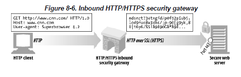
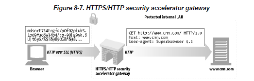
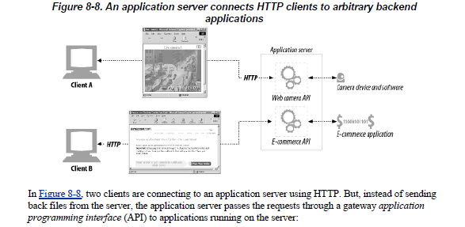
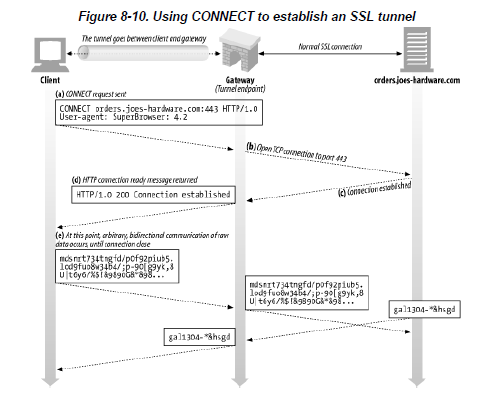

# 8장. 통합점: 게이트웨이, 터널, 릴레이

## 게이트웨이

- 서로 다른 네트워크나 프로토콜이 통신 가능하게끔 해주는 장치
  - ex. TTP 프로토콜과 HTTP가 아닌 프로토콜의 통신
- 다른 네트워크로 가기 위한 문
- <클라이언트 프로토콜>/<서버 프로토콜> 로 구분해서 표기
  - ex. HTTP 클라이언트와 FTP 서버 사이에 게이트웨이가 있다면 HTTP/FTP로 표기

### HTTP/\*: 서버 측 웹 게이트웨이

- 참고로 \*은 기타 다른 프로토콜 등을 의미함.
- 클라이언트로부터 HTTP 요청이 원 서버로 들어오는 시점에 게이트웨이가 이 HTTP 요청을 다른 프로토콜로 전환

### HTTP/HTTPS: 서버 측 보안 게이트웨이



- 기업 내부의 모든 웹 요청을 암호화함으로써 개인 정보 보호와 보안을 제공하는데 사용

### HTTPS/HTTP: 클라이언트 측 보안 가속 게이트웨이



- 보안 HTTPS 트래픽을 받아서 복호화하고, 웹 서버로 보낼 일반 HTTP 요청을 만듦.

### 애플리케이션 게이트웨이(리소스 게이트웨이)



- 애플리케이션 서버는 게이트웨이의 애플리케이션 프로그래밍 인터페이스(API)를 통해서 서버에서 동작하고 있는 애플리케이션에 요청을 전달.
- 흔히 사용하고 있는 API라고 생각하면 될 듯.
- 책에 있는 CGI 관련 내용은 현재 더이상 잘 사용되지 않아서 설명 생략

### 게이트웨이와 프록시 차이점

- 공통점
  - 클라이언트와 서버의 중계 역할
- 차이점
  - 게이트웨이는 서로 다른 프로토콜이 통신 가능하도록 연결
- 결론
  - 프로토콜은 같은데 서버 주소가 다르다
    => 양쪽에서 HTTP 통신을 사용한다면 기술적으로는 프락시
  - 서로 다른 프로토콜이 통신을 한다
    => 게이트 웨이

## 애플리케이션 인터페이스와 웹 서비스

- 애플리케이션 인터페이스
  - 데이터를 교환하려는 두 애플리케이션 사이에서 프로토콜 인터페이스를 맞추는 게 까다로움.
  - 또한, 애플리케이션이 상호 운용을 하다보면 HTTP 헤더로는 표현하기 힘든 복잡한 정보를 교환해야 할 수도 있음.
  - 19장에서 http 확장의 예와 HTTP 위에 프로토콜을 덧씌어 정보 교환하는 것에 대해 배울 것.
- 웹 서비스
  - 애플리케이션을 정보를 공유하는데 사용하는 원리
  - 과거에는 SOAP(Simple Object Access Protocol)을 통해 XML을 사용하여 정보를 공유했지만, 현대에는 REST(Representatinal State Transfer)와 JSON을 주로 사용 데이터 교환

## 터널

- HTTP 프로토콜을 지원하지 않는 애플리케이션에 HTTP 애플리케이션을 사용해 접근하는 방법을 제공
  - 터널을 사용하는 가장 일반적인 이유는 HTTP 커넥션을 통해서 HTTP가 아닌 트래픽을 전송하기 위한 것
  - 이 외 다른 프로토콜을 HTTP 위에 올리는 것 가능

### CONNECT로 HTTP 터널 커넥션 맺기

- 터널은 HTTP의 CONNECT 메서드를 사용하여 커넥션을 맺음.

    <details>
    <summary>📌CONNECT 메서드란?</summary>

  - 요청한 리소스에 대해 양방향 연결을 시작하는 메소드
  - 터널을 열기 위해서 사용될 수 있음.
  </details>

- 연결 과정
  

  1. 클라이언트는 게이트웨이에 터널을 연결하기 위해 CONNECT 요청
  2. CONNECT 메서드는 TCP 커넥션을 위해 게이트웨이에 터널 연결을 요청
  3. TCP 커넥션이 맺어지면 게이트웨이는 클라이언트에게 200 상태를 전달
  4. 터널이 연결되고 데이터가 전달

- CONNECT 요청

  - 시작줄의 요청 URI는 호스트명이 대신하며 포트를 기술해야 함.
  - CONNECT 메서드의 HTTP 메시지는 시작줄만 다르고 나머지 HTTP 요청 헤더 부분은 다른 HTTP 메서드 메시지들과 동일
    ```
    CONNECT 호스트명:포트 번호 HTTP버전
    HTTP 요청헤더
    ```
    ex. 사용 예시
    ```
    CONNECT home.netscape.com:443 HTTP/1.0
    User-agent: Mozilla/4.0
    ```

- CONNECT 응답
  - 클라이언트는 요청 전송 후, 게이트웨이 응답을 기다림.
  - 일반 HTTP 메시지와 같이 200 응답 코드는 성공을 의미
  - 200 상태 코드일 때 사유 구절은 `Connection Established`로 표기
  - 일반적은 HTTP 응답과는 달리, Content-Type 헤더 필요 X
  - ex. CONNECT 응답 메시지 형태
    ```
    HTTP/1.0 200 Connection Established
    Proxy-agent: Netscape-Proxy/1.1
    ```

### SSL 터널링


- SSL 터널링에는 프록시 서버를 통해 백엔드 서비스 또는 보안 서버에 대한 SSL 연결이 필요한 클라이언트가 포함됨.
- 여기서 프록시 서버는 클라이언트와 백엔드 서비스 간의 연결을 열고, SSL 연결에 직접적인 간섭 없이 데이터를 양쪽에 복사

- 터널은 원래 방화벽을 통해서 암호화된 SSL 트래픽을 전달하려고 개발

#### SSL 터널링의 특징

- HTTPS URL을 사용하여 클라이언트와 서버 간에 SSL 터널링을 수행하려면 클라이언트가 SSL 및 HTTPS를 지원해야 함.
  - 클라이언트가 HTTPS를 지원하지 않는 경우 Proxy Server의 HTTPS 프록시 기능 사용 가능
- SSL 터널링의 보안은 프록시를 사용하지 않는 SSL과 동등.
  - 이는 프록시 서버를 사용해도 SSL의 보안이 전혀 변경되거나 감소하지 않음을 의미
- SSL 터널링의 프록시 서버는 암호화되어 있으므로 클라이언트와 서버 간의 트랜잭션에 액세스 불가능
  - 이는 프록시 서버나 제3자로부터 도청이 불가능함을 의미

#### SSL 터널링 vs HTTP/HTTPS 게이트웨이

- HTTP/HTTPS 게이트웨이
  

  - 원격 HTTPS 서버와 SSL 세션을 시작하는 게이트웨이(클라이언트 대신)를 두고 클라이언트 측의 HTTPS 트랜잭션을 수행하는 방식
  - 응답은 프락시가 받아서 복호화하고 난 후에 HTTP(보안이 좋지 않은, 보안이 적용되지 않은)를 통해 클라이언트로 전송

- SSL 터널링
  

  - 프록시에 SSL을 구현할 필요 X
  - SSL 세션은 클라이언트가 생성한 요청과 목적지(보안이 적용된) 웹 서버 간에 생성
  - 프락시 서버는 트랜잭션으 보안에는 관여하지 않고 암호화된 데이터를 그대로 터널링

### 터널 인증

- HTTP의 다른 기능들을 터널과 함께 사용 가능
  - ex. 프록시 인증 기능 - 클라이언트가 터널을 사용할 수 있는 권한을 검사하는 용도

### 터널 보안에 대한 고려사항들

- 프로토콜이 터널을 올바른 용도로 사용하고 있는지 검증할 방법이 X
- 터널의 오용을 최소화 하기 위해 잘 알려진 특정 포트(ex. HTTPS 전용 포트 443)만을 터널링할 수 있게 허용해야 함.

## 릴레이

- HTTP 명세를 완전히 준수하지는 않는 간단 HTTP 프록시
- 커넥션을 맺기 위한 HTTP 통신을 한 다음, 바이트를 맹목적으로 전달함.
- 이 때, 맹목적 릴레이가 COnnection 헤더를 제대로 처리하지 못해서 kepp-alive 커넥션이 행에 걸리는 문제가 있음.
- 이러한 문제를 해결하기 위해서 HTTP를 제대로 준수하는 프락시 사용해야 함.

### 릴레이와 프록시의 차이점

- 공통점
  - 클라이언트와 서버 사이에서 메시지를 전달(relay)해 주는 기능
- 차이점
  - 릴레이
    - 클라이언트와 서버 사이의 메세지를 전달해주는 기능이 전부
  - 프록시
    - 클라이언트에게는 proxy가 서버인 것 처럼 보이게 하고, 서버에게는 proxy가 클라이언트인 것 처럼 보이게 함.

## 참고

[SSL 터널링이란?](https://www.geeksforgeeks.org/what-is-ssl-tunneling/)  
[CONNECT로 HTTP 커넥션 맺기](https://tigger.dev/entry/network-gateway-tunnel-relay)  
[프록시와 게이트웨이 차이점](https://swimjiy.github.io/2020-04-11-web-gateway)  
[프록시 서버와 릴레이 서버의 차이점](https://velog.io/@ghkstmd00/%ED%94%84%EB%A1%9D%EC%8B%9C%EC%84%9C%EB%B2%84%EC%99%80-%EB%A6%B4%EB%A0%88%EC%9D%B4-%EC%84%9C%EB%B2%84%EC%9D%98-%EC%B0%A8%EC%9D%B4%EC%A0%90)  
[CONNECT 메서드](https://developer.mozilla.org/ko/docs/Web/HTTP/Methods/CONNECT)
